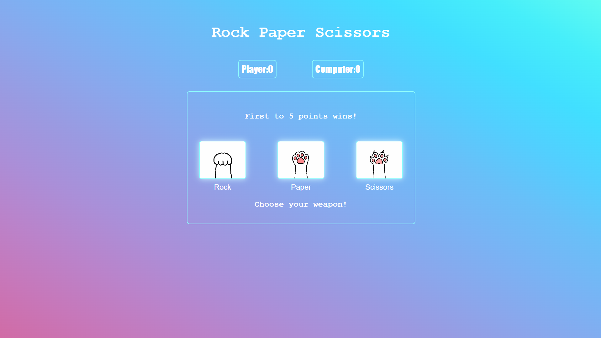

# ✊📄✂️ Rock Paper Scissors

A simple Rock Paper Scissors game built with **HTML, CSS, and JavaScript** as part of **The Odin Project**. The game is fully interactive and uses JavaScript DOM manipulation and event listeners.

## 🚀 Features

- Interactive UI
- Play against the computer
- Random computer choices
- Live score tracking
- First player to reach **5 points** wins
- Round result displayed after every move
- "Play Again" button to restart the game
- Buttons are disabled when the game ends

## 🛠️ Built With

- HTML5
- CSS3
- JavaScript (ES6)
- DOM Manipulation
- Event Listeners

## 🎮 How to Play

1. Click **Rock**, **Paper**, or **Scissors**.
2. The computer randomly chooses its move.
3. The winner of the round earns one point.
4. The first player to reach **5 points** wins the game.
5. Click **Play Again** to start a new game.

## 📚 What I Learned

Through this project, I practiced:

- Selecting DOM elements
- Handling user events with `addEventListener()`
- Updating the DOM dynamically
- Writing reusable functions
- Working with game logic and conditionals
- Managing application state using variables
- Building an interactive web application

## 📸 Preview

;

## 🌐 Live Demo

https://7pixiee.github.io/Rock-Paper-Scissors